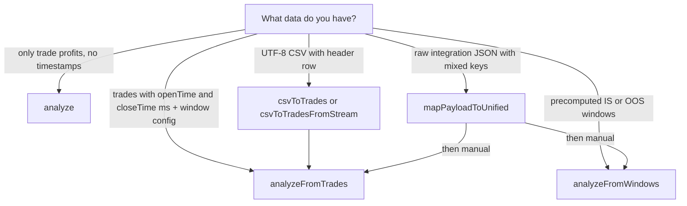

# Engine entrypoints: input and output map

This document is the **navigation map** for `@kiploks/engine-core` and `@kiploks/engine-contracts`. It describes **only what this repository exposes**.

**Packages:** `@kiploks/engine-core`, `@kiploks/engine-contracts`. **Optional CSV:** `@kiploks/engine-adapters`.

## Node and module format

Published packages expose **CommonJS** (`main` points to `dist/index.js`). In TypeScript, prefer:

```ts
import { analyze } from "@kiploks/engine-core";
```

`require("@kiploks/engine-core")` works in plain CommonJS.

---

## Choosing an entrypoint (decision flow)



**Text fallback** (if Mermaid does not render in your viewer):

- **Only trade profits, no timestamps** → call **`analyze()`**
- **Trades with `openTime` / `closeTime` (Unix ms) + `windowConfig` + `wfaInputMode`** → **`analyzeFromTrades()`**
- **Precomputed IS/OOS windows** → **`analyzeFromWindows()`**
- **UTF-8 CSV (header row)** → **`csvToTrades`** or **`csvToTradesFromStream`** → then **`analyzeFromTrades()`** (or **`analyze()`** if you only need summary without WFA)
- **Raw integration JSON** (mixed keys) → **`mapPayloadToUnified()`** → then **manually** call **`analyzeFromWindows()`** or **`analyzeFromTrades()`** with the normalized data (this function does not analyze by itself)

`analyze`, `analyzeFromTrades`, and `analyzeFromWindows` are **different scenarios**, not “the same analysis with extras.” `analyze()` is the smallest surface (summary and metadata). WFA entrypoints need window configuration and modes defined in the contracts.

---

## Warning: `mapPayloadToUnified` is not analysis

`mapPayloadToUnified` (**[`packages/core/src/mapPayloadToUnified.ts`](../packages/core/src/mapPayloadToUnified.ts)**) is a **pure normalization** step: it copies and rewrites known subtrees (for example `backtestResult`, `walkForwardAnalysis` periods) so keys and decimal returns align with what downstream code expects.

It does **not**:

- compute net profit or Sharpe,
- run WFA or permutations,
- fill missing markets or trades.

**Mental model:** it moves known numbers into the right shape; it does not invent analytics. After normalization you still call `analyze`, `analyzeFromTrades`, `analyzeFromWindows`, or other builders as appropriate.

See also **[`examples-map-payload-to-unified.md`](examples-map-payload-to-unified.md)**.

---

## Map

| Task | API | Authoritative types | Guaranteed output (high level) | Conditional blocks and typical `available: false` |
|------|-----|---------------------|--------------------------------|-----------------------------------------------------|
| Basic analyze | `analyze()` | [`packages/contracts/src/analyzeContract.ts`](../packages/contracts/src/analyzeContract.ts) (`AnalyzeInput`, `AnalyzeOutput`) | `summary`, `metadata` (hashes, versions) | N/A |
| WFA from trades | `analyzeFromTrades()` | [`packages/contracts/src/wfaAnalysisContract.ts`](../packages/contracts/src/wfaAnalysisContract.ts) (`TradeBasedWFAInput`, `WFAAnalysisOutput`) | Extends `AnalyzeOutput` with `wfe`, `consistency`, `warnings`, and `BlockResult` sections | See [`packages/contracts/src/errors.ts`](../packages/contracts/src/errors.ts) `KiploksUnavailableReason`: e.g. `parameterStability` often `parameters_not_provided`; `benchmark` often `equity_curve_not_provided`; `dqg` / `killSwitch` / `robustnessNarrative` often `*_not_in_public_wfa` in public WFA mode |
| WFA from windows | `analyzeFromWindows()` | Same file (`PrecomputedWFAInput`, `WFAAnalysisOutput`) | Same family as row above | Same `BlockResult` rules; `parameters` on windows unlock parameter stability when data allows |
| Path Monte Carlo (equity curve) | `buildPathMonteCarloSimulation()` | [`packages/contracts/src/pathMonteCarlo.ts`](../packages/contracts/src/pathMonteCarlo.ts) | Percentile bands, labels, `interpretation`, or `null` | **Not** part of `analyze*()` JSON; call separately. See [`MONTE_CARLO_PATH.md`](MONTE_CARLO_PATH.md). |
| CSV to trades | `csvToTrades`, `csvToTradesFromStream` | [`packages/adapters`](../packages/adapters/README.md) | `Trade[]` for downstream calls | Stream: `maxTrades` cap (see adapter README) |
| Normalize integration JSON | `mapPayloadToUnified()` | [`packages/contracts/src/unifiedPayload.ts`](../packages/contracts/src/unifiedPayload.ts) | `UnifiedIntegrationPayload` (normalized record) | Not a numeric engine; see warning above |

For **warning codes** inside `warnings[]`, see **[`ERROR_CATALOG.md`](ERROR_CATALOG.md)** and [`KiploksWarningCode`](../packages/contracts/src/errors.ts).

---

## Why there is no single `runEverything()` function

A catch-all entry point would either:

1. **Hide missing data** (silent zeros or unclear defaults), or  
2. **Freeze a giant optional-only object** that couples unrelated inputs (trades, windows, equity, WFA) and breaks on every contract tweak.

The library instead exposes **explicit entrypoints** and uses **`BlockResult`** with `available: false` and a **stable `reason`** when a block cannot be computed honestly. That is intentional.

See **[`OPEN_CORE_INTEGRATION_PRINCIPLES.md`](OPEN_CORE_INTEGRATION_PRINCIPLES.md)** for contributor-facing wording.

---

## Minimum JSON examples

Shapes **must** match the TypeScript types in `packages/contracts`. Prefer **small** examples here; use the linked files as source of truth.

### `analyze()`

[`AnalyzeInput`](../packages/contracts/src/analyzeContract.ts): at least one trade with `profit` (decimal fraction of capital).

```json
{
  "trades": [{ "profit": 0.05 }, { "profit": -0.02 }, { "profit": 0.08 }]
}
```

### `analyzeFromTrades()`

[`TradeBasedWFAInput`](../packages/contracts/src/wfaAnalysisContract.ts): `trades` with `profit`, `openTime`, `closeTime` (Unix ms), `windowConfig`, `wfaInputMode: "tradeSlicedPseudoWfa"`.

You need **enough calendar span** and trades for the slicer to form **at least two** full windows (see [`docs/examples/01-minimal-analyze.md`](examples/01-minimal-analyze.md) and WFA examples).

### `analyzeFromWindows()`

[`PrecomputedWFAInput`](../packages/contracts/src/wfaAnalysisContract.ts): `windows` array with `period`, `inSample`, `outOfSample`, and `wfaInputMode: "precomputed"`.

Minimal shape (two windows; `period` uses ISO date strings):

```json
{
  "wfaInputMode": "precomputed",
  "windows": [
    {
      "period": { "start": "2019-01-01", "end": "2019-04-01" },
      "inSample": { "return": 0.12 },
      "outOfSample": { "return": 0.09 }
    },
    {
      "period": { "start": "2019-04-01", "end": "2019-07-01" },
      "inSample": { "return": 0.08 },
      "outOfSample": { "return": 0.06 }
    }
  ]
}
```

Optional **`equityCurve`** on the input can help unlock benchmark-related paths when the contract and data allow it. Optional **`parameters`** per window feeds parameter stability when provided.

### `AnalyzeConfig` (second argument to `analyze`, `analyzeFromTrades`, `analyzeFromWindows`)

[`AnalyzeConfig`](../packages/contracts/src/analyzeContract.ts):

| Field | Role |
| ----- | ---- |
| `seed` | Deterministic draws (permutations, professional blocks); default **42** where the engine applies a default. |
| `decimals` | Rounding for profits and hashes (package default if omitted). |
| `permutationN` | WFE permutation replicates (bounded in contracts, typically 100-10000). |
| `monteCarloBootstrapN` | **Precomputed WFA only:** bootstrap iterations for professional `monteCarloValidation` (default **1000**, clamp **100-50000**). Ignored or N/A for `analyzeFromTrades` in current builds unless wired explicitly. |

---

## Troubleshooting: `available: false` and warnings

A block with **`available: false`** is **not a crash** - it means the engine **refuses to fake** that block because required inputs are missing. Read **`reason`** on the block (`KiploksUnavailableReason` in [`packages/contracts/src/errors.ts`](../packages/contracts/src/errors.ts)).

For **behavioral cautions** (low trade count, low window count, weak p-value, etc.), see **`warnings[]`** on the result and the full **[`ERROR_CATALOG.md`](ERROR_CATALOG.md)**.

If something looks “empty,” check **inputs first** (equity curve for benchmark, `parameters` on windows for parameter stability, public WFA limits for DQG / kill switch narratives).

---

## Doc drift and stable references

When contracts change, **this file can go stale**. Prefer:

- Links to **`packages/contracts/src/*.ts`** in this repo (paths above), and  
- **[`CHANGELOG.md`](../CHANGELOG.md)** when upgrading `@kiploks/engine-*` versions.

---

## See also

- **[`OPEN_CORE_INTEGRATION_PRINCIPLES.md`](OPEN_CORE_INTEGRATION_PRINCIPLES.md)** - design principles and `runEverything()`.  
- **[`examples-map-payload-to-unified.md`](examples-map-payload-to-unified.md)** - `mapPayloadToUnified` and CSV-first flow.  
- **[`examples/README.md`](examples/README.md)** - step-by-step examples.  
- **[`ERROR_CATALOG.md`](ERROR_CATALOG.md)** - warning and error codes.  
- **[`MONTE_CARLO_SIMULATION_IMPLEMENTATION.md`](MONTE_CARLO_SIMULATION_IMPLEMENTATION.md)** - path MC vs window bootstrap index.
